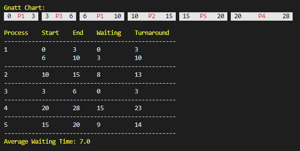

# CPU Scheduling

This Machine Project was implemented as one of the requirements for the course CSOPESY.

### Algorithms:

1. First-Come First-Serve (FCFS)
2. Non-preemptive Shortest-Job First (NSJF)
3. Preemptive Shortest-Job First (PSJF)
4. Round-Robin (RR)

## Input:

- The first line contains 3 integers separated by space, X Y Z.

  - X denotes the CPU scheduling algorithm.
  - Y denotes the number of processes where 3 ≤ Y ≤ 100
  - Z denotes a time slice value (applicable for Round-Robin algorithm only), where 1 ≤ Z ≤ 100.

- If the CPU scheduling algorithm indicated by the value of W is not the
  Round-Robin algorithm, this value must be set (to 1) but ignored.

- There will be Y lines of space-separated integers A B C.
  - A is the process ID,
  - B is the arrival time, and
  - C is the total execution time.

## Output:

- The output prints Y lines of processes that show the processes, all start and end times, waiting time, and turnaround time.
- The last line of the output displays the average waiting time.

